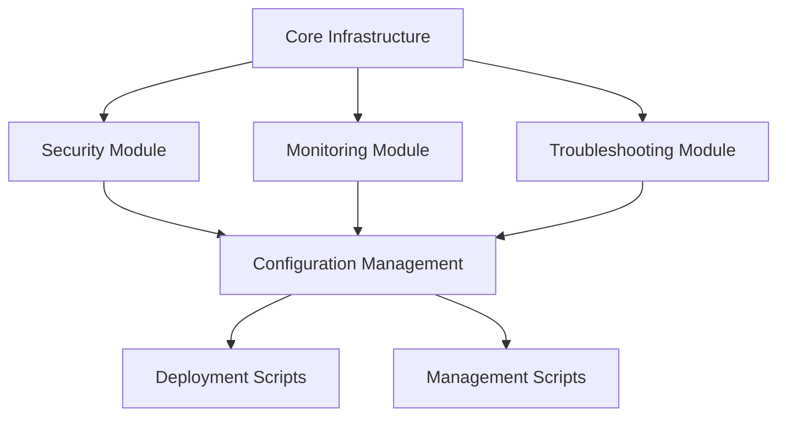

# Windows Server PowerShell Solutions Suite - Architecture Documentation

**Author:** Adrian Johnson <adrian207@gmail.com>  
**Version:** 2.0.0  
**Date:** December 2024  
**Document Type:** Technical Architecture Specification

---

## 📐 **System Architecture Overview**

The Windows Server PowerShell Solutions Suite is architected as a modular, scalable, and enterprise-grade automation platform designed to address the complex requirements of modern Windows Server environments. The architecture follows industry best practices for maintainability, extensibility, and operational excellence.

## 🏗️ **Architectural Principles**

### **1. Modular Design**
- **Component Isolation**: Each Windows Server role is implemented as an independent module
- **Loose Coupling**: Minimal dependencies between components
- **High Cohesion**: Related functionality grouped within modules
- **Interface Segregation**: Clean, well-defined interfaces between components

### **2. Scalability**
- **Horizontal Scaling**: Support for distributed deployments across multiple servers
- **Vertical Scaling**: Efficient resource utilization on individual servers
- **Load Distribution**: Built-in load balancing and failover capabilities
- **Performance Optimization**: Asynchronous operations and efficient algorithms

### **3. Security-First Design**
- **Defense in Depth**: Multiple layers of security controls
- **Principle of Least Privilege**: Minimal required permissions
- **Secure by Default**: Secure configurations out of the box
- **Audit Compliance**: Comprehensive logging and monitoring

### **4. Maintainability**
- **Code Reusability**: Common functionality abstracted into shared modules
- **Documentation-Driven**: Comprehensive documentation for all components
- **Test Coverage**: Extensive unit and integration testing
- **Version Control**: Git-based version control with semantic versioning

## 🎯 **Solution Architecture**

### **High-Level Architecture Diagram**

```
┌─────────────────────────────────────────────────────────────────┐
│                    Windows Server PowerShell Solutions Suite     │
├─────────────────────────────────────────────────────────────────┤
│  Presentation Layer (CLI, Web UI, API)                         │
├─────────────────────────────────────────────────────────────────┤
│  Orchestration Layer (Workflow Engine, Job Scheduler)          │
├─────────────────────────────────────────────────────────────────┤
│  Business Logic Layer (Core Modules, Security, Monitoring)     │
├─────────────────────────────────────────────────────────────────┤
│  Data Access Layer (Configuration, State Management)           │
├─────────────────────────────────────────────────────────────────┤
│  Infrastructure Layer (Windows Server Roles, APIs)             │
└─────────────────────────────────────────────────────────────────┘
```

### **Component Architecture**

#### **1. Core Infrastructure Layer**
- **Windows Server APIs**: Native Windows Server management interfaces
- **PowerShell Modules**: Core PowerShell functionality and cmdlets
- **System Services**: Windows services and background processes
- **Registry and Configuration**: System configuration management

#### **2. Data Access Layer**
- **Configuration Management**: JSON-based configuration templates
- **State Persistence**: SQLite and file-based state storage
- **Caching Layer**: In-memory and distributed caching
- **Data Validation**: Input validation and sanitization

#### **3. Business Logic Layer**
- **Core Modules**: Domain-specific business logic
- **Security Engine**: Authentication, authorization, and encryption
- **Monitoring Engine**: Health monitoring and alerting
- **Workflow Engine**: Process automation and orchestration

#### **4. Orchestration Layer**
- **Job Scheduler**: Task scheduling and execution
- **Workflow Manager**: Complex process orchestration
- **Event Processing**: Event-driven architecture support
- **Resource Management**: Resource allocation and optimization

#### **5. Presentation Layer**
- **Command Line Interface**: PowerShell cmdlets and scripts
- **Web Management Interface**: RESTful API and web dashboard
- **Configuration UI**: Graphical configuration management
- **Reporting Interface**: Analytics and reporting capabilities

## 🔧 **Module Architecture**

### **Module Structure**

Each solution module follows a consistent architectural pattern:

```
Module-Name/
├── Modules/                    # Core PowerShell modules
│   ├── Module-Core.psm1       # Core functionality
│   ├── Module-Security.psm1   # Security features
│   ├── Module-Monitoring.psm1 # Monitoring capabilities
│   └── Module-Troubleshooting.psm1 # Diagnostics
├── Scripts/                   # Deployment and management scripts
│   ├── Deployment/            # Installation scripts
│   ├── Configuration/         # Configuration scripts
│   ├── Security/              # Security hardening scripts
│   ├── Monitoring/            # Monitoring setup scripts
│   ├── Troubleshooting/      # Diagnostic scripts
│   └── Enterprise-Scenarios/  # Enterprise use cases
├── Examples/                  # Usage examples
├── Tests/                     # Test suites
├── Documentation/             # Technical documentation
└── Configuration/            # Configuration templates
```

### **Module Dependencies**



## 🔒 **Security Architecture**

### **Security Layers**

#### **1. Authentication Layer**
- **Multi-Factor Authentication**: Support for MFA providers
- **Certificate-Based Authentication**: PKI integration
- **Azure AD Integration**: Cloud identity provider support
- **Local Authentication**: Windows authentication fallback

#### **2. Authorization Layer**
- **Role-Based Access Control**: Granular permission management
- **Attribute-Based Access Control**: Dynamic access decisions
- **Resource-Level Permissions**: Fine-grained resource access
- **Delegation Support**: Administrative delegation capabilities

#### **3. Data Protection Layer**
- **Encryption at Rest**: Data encryption using Windows DPAPI
- **Encryption in Transit**: TLS/SSL for all communications
- **Key Management**: Centralized key management and rotation
- **Data Classification**: Automatic data classification and handling

#### **4. Audit and Compliance Layer**
- **Comprehensive Logging**: All activities logged with context
- **Audit Trail**: Immutable audit trail for compliance
- **Compliance Reporting**: Automated compliance report generation
- **Forensic Capabilities**: Digital forensics and investigation support

## 📊 **Monitoring and Observability Architecture**

### **Monitoring Stack**

#### **1. Data Collection**
- **Performance Counters**: Windows performance counter collection
- **Event Logs**: Windows event log aggregation
- **Custom Metrics**: Application-specific metrics
- **Health Checks**: Automated health status monitoring

#### **2. Data Processing**
- **Real-Time Processing**: Stream processing for immediate alerts
- **Batch Processing**: Scheduled processing for analytics
- **Data Aggregation**: Time-series data aggregation
- **Anomaly Detection**: Machine learning-based anomaly detection

#### **3. Data Storage**
- **Time-Series Database**: Optimized for metrics storage
- **Log Storage**: Centralized log storage and indexing
- **Configuration Database**: Configuration and state storage
- **Archive Storage**: Long-term data retention

#### **4. Visualization and Alerting**
- **Dashboards**: Real-time operational dashboards
- **Reports**: Scheduled and ad-hoc reporting
- **Alerting**: Multi-channel alerting (email, SMS, webhooks)
- **Analytics**: Trend analysis and capacity planning

## 🔄 **Deployment Architecture**

### **Deployment Models**

#### **1. Single-Server Deployment**
- **Standalone Installation**: Single server with all components
- **Local Configuration**: Local configuration management
- **Direct Management**: Direct PowerShell management
- **Use Case**: Small environments, testing, development

#### **2. Distributed Deployment**
- **Component Distribution**: Components distributed across multiple servers
- **Centralized Management**: Central management console
- **Load Balancing**: Load distribution across components
- **Use Case**: Medium to large environments, production

#### **3. High Availability Deployment**
- **Active-Passive**: Primary and standby servers
- **Active-Active**: Multiple active servers with load balancing
- **Failover Automation**: Automated failover capabilities
- **Use Case**: Critical production environments

#### **4. Cloud-Hybrid Deployment**
- **On-Premises Core**: Core components on-premises
- **Cloud Extension**: Cloud-based components and services
- **Hybrid Identity**: Integrated identity management
- **Use Case**: Hybrid cloud environments

### **Deployment Automation**

#### **1. Infrastructure as Code**
- **PowerShell DSC**: Desired State Configuration
- **ARM Templates**: Azure Resource Manager templates
- **Terraform**: Infrastructure provisioning
- **Ansible**: Configuration management

#### **2. CI/CD Pipeline**
- **Source Control**: Git-based version control
- **Build Automation**: Automated build and testing
- **Deployment Automation**: Automated deployment pipelines
- **Quality Gates**: Automated quality validation

## 🔌 **Integration Architecture**

### **Integration Patterns**

#### **1. API Integration**
- **RESTful APIs**: Standard REST API interfaces
- **GraphQL**: Flexible data querying
- **Webhooks**: Event-driven integration
- **Message Queues**: Asynchronous messaging

#### **2. Data Integration**
- **ETL Processes**: Extract, Transform, Load operations
- **Real-Time Streaming**: Real-time data streaming
- **Data Synchronization**: Bi-directional data sync
- **Data Federation**: Federated data access

#### **3. Service Integration**
- **Microservices**: Service-oriented architecture
- **Event-Driven**: Event-driven architecture
- **Service Mesh**: Service-to-service communication
- **API Gateway**: Centralized API management

### **Third-Party Integrations**

#### **1. SIEM Integration**
- **Splunk**: Log aggregation and analysis
- **QRadar**: Security information and event management
- **ArcSight**: Security event management
- **ELK Stack**: Elasticsearch, Logstash, Kibana

#### **2. Monitoring Integration**
- **SCOM**: System Center Operations Manager
- **Zabbix**: Open-source monitoring
- **Prometheus**: Metrics collection and alerting
- **Grafana**: Visualization and dashboards

#### **3. Cloud Integration**
- **Azure**: Microsoft Azure cloud services
- **AWS**: Amazon Web Services integration
- **Google Cloud**: Google Cloud Platform integration
- **Multi-Cloud**: Cross-cloud platform support

## 📈 **Performance Architecture**

### **Performance Optimization**

#### **1. Caching Strategy**
- **In-Memory Caching**: Fast access to frequently used data
- **Distributed Caching**: Shared cache across multiple servers
- **Cache Invalidation**: Intelligent cache invalidation
- **Cache Warming**: Proactive cache population

#### **2. Asynchronous Processing**
- **Background Jobs**: Long-running background processes
- **Message Queues**: Asynchronous message processing
- **Event Processing**: Event-driven processing
- **Parallel Processing**: Multi-threaded operations

#### **3. Resource Optimization**
- **Connection Pooling**: Database connection optimization
- **Memory Management**: Efficient memory utilization
- **CPU Optimization**: Multi-core processing optimization
- **I/O Optimization**: Efficient disk and network I/O

### **Scalability Patterns**

#### **1. Horizontal Scaling**
- **Load Balancing**: Traffic distribution across servers
- **Auto-Scaling**: Automatic scaling based on demand
- **Service Discovery**: Dynamic service discovery
- **Circuit Breakers**: Fault tolerance patterns

#### **2. Vertical Scaling**
- **Resource Allocation**: Dynamic resource allocation
- **Performance Tuning**: Server performance optimization
- **Capacity Planning**: Proactive capacity management
- **Resource Monitoring**: Continuous resource monitoring

## 🔧 **Configuration Architecture**

### **Configuration Management**

#### **1. Configuration Hierarchy**
```
Global Configuration
├── Environment Configuration (Dev, Test, Prod)
├── Server Role Configuration
├── Component Configuration
└── Instance Configuration
```

#### **2. Configuration Sources**
- **JSON Files**: Declarative configuration files
- **Environment Variables**: Environment-specific settings
- **Registry**: Windows Registry configuration
- **Database**: Centralized configuration storage

#### **3. Configuration Validation**
- **Schema Validation**: JSON schema validation
- **Dependency Validation**: Configuration dependency checking
- **Environment Validation**: Environment-specific validation
- **Security Validation**: Security configuration validation

## 🧪 **Testing Architecture**

### **Testing Strategy**

#### **1. Test Pyramid**
- **Unit Tests**: Individual component testing (70%)
- **Integration Tests**: Component interaction testing (20%)
- **End-to-End Tests**: Complete workflow testing (10%)

#### **2. Test Types**
- **Functional Tests**: Feature functionality validation
- **Performance Tests**: Performance and load testing
- **Security Tests**: Security vulnerability testing
- **Compliance Tests**: Regulatory compliance validation

#### **3. Test Automation**
- **Continuous Testing**: Automated test execution
- **Test Data Management**: Test data generation and management
- **Test Environment**: Isolated test environments
- **Test Reporting**: Comprehensive test reporting

## 📚 **Documentation Architecture**

### **Documentation Strategy**

#### **1. Documentation Types**
- **Technical Documentation**: API and technical specifications
- **User Documentation**: End-user guides and tutorials
- **Administrator Documentation**: System administration guides
- **Developer Documentation**: Development and customization guides

#### **2. Documentation Standards**
- **Markdown Format**: Consistent markdown formatting
- **Version Control**: Documentation version control
- **Review Process**: Peer review and validation
- **Accessibility**: Accessible documentation standards

## 🔮 **Future Architecture Considerations**

### **Emerging Technologies**
- **Containerization**: Docker and Kubernetes support
- **Serverless Computing**: Function-as-a-Service integration
- **Edge Computing**: Edge deployment capabilities
- **AI/ML Integration**: Machine learning and AI capabilities

### **Architecture Evolution**
- **Microservices Migration**: Gradual migration to microservices
- **Cloud-Native**: Cloud-native architecture patterns
- **API-First**: API-first design principles
- **Event-Driven**: Event-driven architecture evolution

---

## 📞 **Architecture Support**

For questions regarding the architecture or technical implementation, please contact:

**Author:** Adrian Johnson  
**Email:** adrian207@gmail.com  
**LinkedIn:** [Adrian Johnson](https://linkedin.com/in/adrian-johnson)

---

*This architecture documentation represents the technical foundation of the Windows Server PowerShell Solutions Suite, designed to meet the demanding requirements of enterprise Windows Server environments.*
