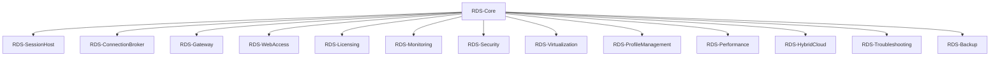

# Remote Desktop Services PowerShell Scripts - Comprehensive Documentation

**Author:** Adrian Johnson <adrian207@gmail.com>  
**Version:** 1.0.0  
**Date:** December 2024

## Table of Contents

1. [Overview](#overview)
2. [Architecture](#architecture)
3. [Installation and Setup](#installation-and-setup)
4. [Module Reference](#module-reference)
5. [Script Reference](#script-reference)
6. [Enterprise Scenarios](#enterprise-scenarios)
7. [Configuration Management](#configuration-management)
8. [Monitoring and Troubleshooting](#monitoring-and-troubleshooting)
9. [Security and Compliance](#security-and-compliance)
10. [Backup and Disaster Recovery](#backup-and-disaster-recovery)
11. [Performance Optimization](#performance-optimization)
12. [Best Practices](#best-practices)
13. [Troubleshooting Guide](#troubleshooting-guide)
14. [API Reference](#api-reference)
15. [Examples and Use Cases](#examples-and-use-cases)

## Overview

The Remote Desktop Services PowerShell Scripts solution provides comprehensive management capabilities for Windows Server Remote Desktop Services, supporting all major enterprise scenarios from centralized application delivery to cloud bursting and advanced virtualization.

### Key Features

- **30 Enterprise Scenarios** - Complete coverage of RDS use cases
- **14 PowerShell Modules** - Comprehensive RDS management capabilities
- **Production-Ready Scripts** - Deployable automation for all scenarios
- **Enterprise-Grade Security** - PAW, compliance, and audit capabilities
- **Hybrid Cloud Integration** - Azure Virtual Desktop and cloud bursting
- **Advanced Monitoring** - Performance, diagnostics, and troubleshooting
- **Backup and DR** - Complete disaster recovery capabilities

### Supported Scenarios

1. **Centralized Application Delivery** - LOB apps, Office 365, SAP
2. **Virtual Desktop Infrastructure (VDI)** - Personal/Pooled desktops
3. **Graphics-Accelerated RDS** - NVIDIA/AMD/Intel GPU support
4. **Hybrid RDS + Azure Virtual Desktop** - Cloud integration
5. **Privileged Access Workstations (PAW)** - Enhanced security
6. **Remote Desktop Gateway** - Secure internet access
7. **RDS with Azure MFA** - Multi-factor authentication
8. **Contractor Access** - Controlled third-party access
9. **Kiosk and Thin Client** - Locked-down terminal environments
10. **Education Computer Lab** - Virtual classrooms
11. **Disaster Recovery** - Business continuity
12. **Application Compatibility Sandbox** - Legacy application support
13. **FSLogix Profile Containers** - Advanced profile management
14. **Load Balancing and High Availability** - Scalability
15. **RDS Web Access Portal** - Unified web-based access
16. **Government/Regulated Environment** - Compliance features
17. **Remote Support and Helpdesk** - IT support
18. **Multi-Forest/Federated Access** - Cross-domain authentication
19. **Time-Limited Access** - Temporary access
20. **Intune Integration** - Device compliance
21. **File Services Integration** - OneDrive, folder redirection
22. **PowerShell Automation** - Infrastructure automation
23. **High-Latency Optimization** - Remote connection optimization
24. **Licensing and Auditing** - CAL management
25. **RDS as Jump Host** - Secure administrative access
26. **Shared Compute Environments** - HPC workloads
27. **Remote Development Environments** - IDE isolation
28. **Cloud Bursting/On-Demand Scaling** - Elastic scaling
29. **Full Desktop Virtualization** - Multi-user sessions
30. **RemoteApp Publishing** - Seamless application integration

## Architecture

### Solution Components

```
Remote Desktop Services PowerShell Scripts
├── Modules/                          # PowerShell modules
│   ├── RDS-Core.psm1                # Core utilities and session management
│   ├── RDS-SessionHost.psm1         # Session Host management
│   ├── RDS-ConnectionBroker.psm1    # Connection Broker and HA
│   ├── RDS-Gateway.psm1             # Gateway management
│   ├── RDS-WebAccess.psm1           # Web Access portal management
│   ├── RDS-Licensing.psm1           # Licensing and CAL management
│   ├── RDS-Monitoring.psm1          # Monitoring and diagnostics
│   ├── RDS-Security.psm1            # Security and compliance
│   ├── RDS-Virtualization.psm1      # VDI management
│   ├── RDS-ProfileManagement.psm1   # Profile management
│   ├── RDS-Performance.psm1         # Performance optimization
│   ├── RDS-HybridCloud.psm1         # Hybrid cloud integration
│   ├── RDS-Troubleshooting.psm1     # Troubleshooting and diagnostics
│   └── RDS-Backup.psm1              # Backup and disaster recovery
├── Scripts/                         # Deployment and management scripts
│   ├── ConnectionBroker/            # Connection Broker scripts
│   ├── Gateway/                     # Gateway scripts
│   ├── Licensing/                   # Licensing scripts
│   ├── Monitoring/                  # Monitoring scripts
│   ├── SessionHost/                 # Session Host scripts
│   ├── Troubleshooting/             # Troubleshooting scripts
│   ├── WebAccess/                   # Web Access scripts
│   └── Enterprise-Scenarios/        # Enterprise scenario scripts
├── Tests/                           # Test suites
├── Examples/                        # Usage examples
└── Documentation/                   # Comprehensive documentation
```

### Module Dependencies



## Installation and Setup

### Prerequisites

- Windows Server 2016 or later
- PowerShell 5.1 or later
- Administrator privileges
- Domain membership (for some features)
- Network connectivity

### Quick Start

1. **Clone the solution**
   ```powershell
   git clone <repository-url>
   cd Remote-Desktop-Services
   ```

2. **Import core module**
   ```powershell
   Import-Module .\Modules\RDS-Core.psm1
   ```

3. **Check prerequisites**
   ```powershell
   Test-RDSPrerequisites
   ```

4. **Deploy enterprise scenario**
   ```powershell
   .\Scripts\Enterprise-Scenarios\Deploy-RDSEnterpriseScenario.ps1 -Scenario "CentralizedApplicationDelivery" -DeploymentName "Production-RDS"
   ```

### Installation Methods

#### Method 1: Individual Component Installation

```powershell
# Install Session Host
.\Scripts\SessionHost\Install-SessionHost.ps1 -SessionHostName "RDS-SH-01" -CollectionName "Production Sessions"

# Install Connection Broker
.\Scripts\ConnectionBroker\Install-ConnectionBroker.ps1 -ConnectionBrokerName "RDS-CB-01"

# Install Gateway
.\Scripts\Gateway\Install-Gateway.ps1 -GatewayName "Corporate Gateway" -EnableSSL -RequireClientCertificates

# Install Web Access
.\Scripts\WebAccess\Install-WebAccess.ps1 -WebAccessName "Corporate Portal" -EnableSSO -CustomizePortal

# Install Licensing
.\Scripts\Licensing\Install-Licensing.ps1 -LicensingServerName "RDS-Licensing" -LicenseMode "PerUser" -EnableActivation
```

#### Method 2: Enterprise Scenario Deployment

```powershell
# Deploy VDI Environment
.\Scripts\Enterprise-Scenarios\Deploy-RDSEnterpriseScenario.ps1 -Scenario "VDI" -DeploymentName "VDI-Production"

# Deploy Graphics-Accelerated RDS
.\Scripts\Enterprise-Scenarios\Deploy-RDSEnterpriseScenario.ps1 -Scenario "GraphicsAccelerated" -DeploymentName "CAD-RDS"

# Deploy Hybrid RDS + Azure
.\Scripts\Enterprise-Scenarios\Deploy-RDSEnterpriseScenario.ps1 -Scenario "HybridRDSAzure" -DeploymentName "Hybrid-RDS"
```

## Module Reference

### RDS-Core Module

Core utilities and advanced session management capabilities.

**Key Functions:**
- `Test-RDSPrerequisites` - Validate system prerequisites
- `Get-RDSServiceStatus` - Get RDS service status
- `New-RDSDeployment` - Create RDS deployment configuration
- `Set-RDSSessionLimit` - Configure session limits
- `Get-RDSSessionStatistics` - Get comprehensive session statistics
- `Test-RDSDeployment` - Test deployment configuration

**Example:**
```powershell
Import-Module .\Modules\RDS-Core.psm1

# Create deployment
$deployment = New-RDSDeployment -DeploymentName "Production-RDS" -SessionHostCount 3

# Set session limits
Set-RDSSessionLimit -MaxSessions 50 -IdleTimeout 60 -SessionTimeout 480

# Get session statistics
$stats = Get-RDSSessionStatistics -TimeRange "LastDay" -IncludePerformanceMetrics -IncludeUserDetails
```

### RDS-Virtualization Module

Complete VDI management with VM pools and assignments.

**Key Functions:**
- `Test-RDSVirtualizationPrerequisites` - Validate VDI prerequisites
- `Install-RDSVirtualizationHost` - Install virtualization host
- `New-RDSVirtualMachinePool` - Create VM pool
- `Set-RDSVirtualMachineAssignment` - Configure user assignments
- `Get-RDSVirtualMachinePoolStatus` - Monitor VM pool status

**Example:**
```powershell
Import-Module .\Modules\RDS-Virtualization.psm1

# Create VM pool
$pool = New-RDSVirtualMachinePool -PoolName "VDI-Pool" -AssignmentType "Pooled" -MaxVMs 50 -MemoryGB 8 -CPUCount 4

# Assign users
Set-RDSVirtualMachineAssignment -PoolName "VDI-Pool" -UserName "john.doe" -AssignmentType "Personal"
```

### RDS-Performance Module

GPU acceleration, bandwidth optimization, and performance monitoring.

**Key Functions:**
- `Enable-RDSGPUAcceleration` - Enable GPU acceleration
- `Set-RDSBandwidthOptimization` - Configure bandwidth optimization
- `Get-RDSPerformanceCounters` - Get performance metrics
- `Start-RDSPerformanceMonitoring` - Start performance monitoring

**Example:**
```powershell
Import-Module .\Modules\RDS-Performance.psm1

# Enable GPU acceleration
Enable-RDSGPUAcceleration -GPUType "NVIDIA" -EnableHardwareAcceleration -MaxGPUMemory 4096

# Configure bandwidth optimization
Set-RDSBandwidthOptimization -EnableCompression -EnableCaching -EnableAdaptiveGraphics
```

### RDS-HybridCloud Module

Azure Virtual Desktop integration and cloud bursting.

**Key Functions:**
- `Connect-RDSAzureVirtualDesktop` - Connect to Azure Virtual Desktop
- `New-RDSCloudBurstingConfiguration` - Configure cloud bursting
- `Set-RDSHybridUserAssignment` - Configure hybrid user assignments
- `Get-RDSHybridStatus` - Monitor hybrid status

**Example:**
```powershell
Import-Module .\Modules\RDS-HybridCloud.psm1

# Connect to Azure
Connect-RDSAzureVirtualDesktop -AzureSubscriptionId "12345678-1234-1234-1234-123456789012" -ResourceGroupName "RDS-Hybrid-RG"

# Configure cloud bursting
New-RDSCloudBurstingConfiguration -BurstingPolicy "CPU" -AzureResourceGroup "RDS-Hybrid-RG" -EnableAutoScaling -MaxInstances 20
```

## Script Reference

### Enterprise Scenario Scripts

#### Deploy-RDSEnterpriseScenario.ps1

Master deployment script supporting all 30 enterprise scenarios.

**Parameters:**
- `Scenario` - Enterprise scenario to deploy
- `DeploymentName` - Name for the deployment
- `ConfigurationFile` - JSON configuration file
- `DryRun` - Test mode without changes

**Example:**
```powershell
# Deploy with configuration file
.\Scripts\Enterprise-Scenarios\Deploy-RDSEnterpriseScenario.ps1 -Scenario "VDI" -ConfigurationFile "C:\Config\VDIConfig.json"

# Dry run test
.\Scripts\Enterprise-Scenarios\Deploy-RDSEnterpriseScenario.ps1 -Scenario "GraphicsAccelerated" -DryRun
```

#### Individual Scenario Scripts

- `Deploy-CentralizedApplicationDelivery.ps1` - Complete app delivery environment
- `Deploy-VDIEnvironment.ps1` - Virtual Desktop Infrastructure
- `Deploy-GraphicsAcceleratedRDS.ps1` - GPU-accelerated RDS
- `Deploy-HybridRDSAzure.ps1` - Hybrid RDS + Azure integration
- `Deploy-PrivilegedAccessWorkstations.ps1` - Secure PAW environment

### Component Installation Scripts

#### Connection Broker Scripts

- `Install-ConnectionBroker.ps1` - Install and configure Connection Broker
- `Configure-HighAvailability.ps1` - Configure HA and failover
- `Monitor-ConnectionBroker.ps1` - Monitor Connection Broker

#### Gateway Scripts

- `Install-Gateway.ps1` - Install and configure Gateway
- `Configure-Gateway.ps1` - Configure Gateway settings
- `Monitor-Gateway.ps1` - Monitor Gateway

#### Licensing Scripts

- `Install-Licensing.ps1` - Install and configure Licensing server
- `Configure-Licensing.ps1` - Configure Licensing settings
- `Monitor-Licensing.ps1` - Monitor Licensing

#### Session Host Scripts

- `Install-SessionHost.ps1` - Install and configure Session Host
- `Configure-SessionHost.ps1` - Configure Session Host settings
- `Monitor-SessionHost.ps1` - Monitor Session Host

#### Web Access Scripts

- `Install-WebAccess.ps1` - Install and configure Web Access
- `Configure-WebAccess.ps1` - Configure Web Access settings
- `Monitor-WebAccess.ps1` - Monitor Web Access

## Enterprise Scenarios

### Centralized Application Delivery

Deploy a centralized application delivery environment for LOB applications.

**Configuration:**
```json
{
  "scenario": "CentralizedApplicationDelivery",
  "deploymentName": "AppDelivery-RDS",
  "sessionHosts": [
    {
      "name": "RDS-SH-01",
      "maxConnections": 50,
      "applications": ["Office365", "SAP", "CustomLOB"]
    }
  ],
  "connectionBroker": {
    "name": "RDS-CB-01",
    "enableHA": true,
    "secondaryBroker": "RDS-CB-02"
  },
  "gateway": {
    "name": "Corporate Gateway",
    "enableSSL": true,
    "authenticationMethod": "SmartCard"
  }
}
```

**Deployment:**
```powershell
.\Scripts\Enterprise-Scenarios\Deploy-CentralizedApplicationDelivery.ps1 -DeploymentName "AppDelivery-RDS" -ConfigurationFile "AppDeliveryConfig.json"
```

### Virtual Desktop Infrastructure (VDI)

Deploy a complete VDI environment with VM pools and user assignments.

**Configuration:**
```json
{
  "scenario": "VDI",
  "deploymentName": "VDI-Production",
  "virtualizationHost": {
    "name": "RDS-VH-01",
    "maxVMs": 100,
    "vmSpecs": {
      "memoryGB": 8,
      "cpuCount": 4,
      "storageGB": 100
    }
  },
  "vmPools": [
    {
      "name": "Pooled-Desktops",
      "assignmentType": "Pooled",
      "maxVMs": 50
    },
    {
      "name": "Personal-Desktops",
      "assignmentType": "Personal",
      "maxVMs": 25
    }
  ]
}
```

**Deployment:**
```powershell
.\Scripts\Enterprise-Scenarios\Deploy-VDIEnvironment.ps1 -DeploymentName "VDI-Production" -ConfigurationFile "VDIConfig.json"
```

### Graphics-Accelerated RDS

Deploy GPU-accelerated RDS for CAD, GIS, and 3D rendering workloads.

**Configuration:**
```json
{
  "scenario": "GraphicsAccelerated",
  "deploymentName": "CAD-RDS",
  "gpuConfiguration": {
    "gpuType": "NVIDIA",
    "enableHardwareAcceleration": true,
    "enableGraphicsVirtualization": true,
    "maxGPUMemory": 4096
  },
  "performanceOptimization": {
    "enableCompression": true,
    "enableCaching": true,
    "enableAdaptiveGraphics": true,
    "enableUDPTransport": true
  }
}
```

**Deployment:**
```powershell
.\Scripts\Enterprise-Scenarios\Deploy-GraphicsAcceleratedRDS.ps1 -DeploymentName "CAD-RDS" -ConfigurationFile "GraphicsConfig.json"
```

## Configuration Management

### JSON Configuration Files

The solution supports comprehensive JSON configuration files for complex deployments.

**RDS-Enterprise-Config.json Structure:**
```json
{
  "globalSettings": {
    "deploymentName": "Enterprise-RDS",
    "domain": "company.com",
    "adminGroup": "RDS-Admins"
  },
  "scenarios": {
    "CentralizedApplicationDelivery": {
      "enabled": true,
      "sessionHosts": 3,
      "maxConnections": 150
    },
    "VDI": {
      "enabled": true,
      "vmPools": 2,
      "maxVMs": 100
    }
  },
  "security": {
    "enablePAW": true,
    "enableAppLocker": true,
    "enableDeviceGuard": true,
    "enableAuditLogging": true
  },
  "performance": {
    "enableGPUAcceleration": true,
    "enableBandwidthOptimization": true,
    "enablePerformanceMonitoring": true
  }
}
```

### Configuration Validation

```powershell
# Validate configuration
$config = Get-Content "RDS-Enterprise-Config.json" | ConvertFrom-Json
Test-RDSConfiguration -Configuration $config

# Deploy with validation
.\Scripts\Enterprise-Scenarios\Deploy-RDSEnterpriseScenario.ps1 -Scenario "VDI" -ConfigurationFile "RDS-Enterprise-Config.json"
```

## Monitoring and Troubleshooting

### Comprehensive Monitoring

The solution provides comprehensive monitoring capabilities across all components.

**Start Monitoring:**
```powershell
# Monitor all components
.\Scripts\Monitoring\Start-RDSMonitoring.ps1 -MonitoringInterval 60 -LogFile "C:\Logs\RDS-Monitoring.log"

# Monitor specific component
.\Scripts\Gateway\Monitor-Gateway.ps1 -IncludePerformanceMetrics -IncludeSSLCertificateStatus
```

**Performance Monitoring:**
```powershell
Import-Module .\Modules\RDS-Performance.psm1

# Start performance monitoring
Start-RDSPerformanceMonitoring -MonitoringInterval 60 -IncludeGraphics -IncludePerformance

# Get performance counters
Get-RDSPerformanceCounters -CounterType "All" -IncludeGraphics -IncludePerformance
```

### Troubleshooting

**Comprehensive Diagnostics:**
```powershell
Import-Module .\Modules\RDS-Troubleshooting.psm1

# Run comprehensive diagnostics
Start-RDSComprehensiveDiagnostics -DiagnosticType "All" -IncludePerformanceAnalysis -IncludeEventLogAnalysis

# Get troubleshooting recommendations
Get-RDSTroubleshootingRecommendations -IssueType "Performance" -Severity "High" -IncludeAutomatedFixes

# Test connectivity
Test-RDSConnectivity -TestType "All" -IncludePerformanceTest -IncludeLatencyTest
```

**Automated Repair:**
```powershell
# Repair configuration issues
Repair-RDSConfiguration -RepairType "All" -ConfirmRepair
```

## Security and Compliance

### Privileged Access Workstations (PAW)

Deploy secure PAW environments with enhanced security.

**PAW Configuration:**
```powershell
Import-Module .\Modules\RDS-Security.psm1

# Create PAW configuration
New-RDSPAWConfiguration -PAWName "Admin-PAW" -SecurityLevel "Maximum" -EnableAppLocker -EnableDeviceGuard -EnableCredentialGuard -EnableAuditLogging
```

**Security Policies:**
```powershell
# Set security policies
Set-RDSSecurityPolicy -PolicyName "Maximum Security" -AuthenticationMethod "MFA" -EncryptionLevel "FIPS" -EnableNetworkLevelAuthentication -EnableSSL -EnableAuditLogging
```

### Compliance Testing

**Test Compliance:**
```powershell
# Test against compliance standards
Test-RDSSecurityCompliance -ComplianceStandard "NIST" -IncludeVulnerabilityAssessment -IncludePolicyValidation -IncludeSecurityRecommendations
```

**Audit Logging:**
```powershell
# Enable comprehensive audit logging
Enable-RDSAuditLogging -AuditLevel "Comprehensive" -LogRetentionDays 90 -EnableSecurityAuditing -EnableSessionAuditing -EnableApplicationAuditing
```

## Backup and Disaster Recovery

### Configuration Backup

**Create Backup:**
```powershell
Import-Module .\Modules\RDS-Backup.psm1

# Create comprehensive backup
New-RDSConfigurationBackup -BackupPath "C:\Backups\RDS" -BackupName "RDSConfig_$(Get-Date -Format 'yyyyMMdd')" -IncludeDeploymentConfig -IncludePolicies -IncludeCertificates -IncludeUserData -CompressBackup
```

**Start Backup Schedule:**
```powershell
# Start automated backup schedule
Start-RDSBackupSchedule -BackupPath "C:\Backups\RDS" -ScheduleInterval "Daily" -BackupType "Both" -RetentionDays 30
```

### Disaster Recovery

**Disaster Recovery Procedures:**
```powershell
# Full disaster recovery
Start-RDSDisasterRecovery -RecoveryType "Full" -BackupPath "C:\Backups\RDS\Latest" -RecoveryMode "Full" -ConfirmRecovery

# Minimal recovery
Start-RDSDisasterRecovery -RecoveryType "Minimal" -ConfirmRecovery
```

## Performance Optimization

### GPU Acceleration

**Enable GPU Acceleration:**
```powershell
Import-Module .\Modules\RDS-Performance.psm1

# NVIDIA GPU acceleration
Enable-RDSGPUAcceleration -GPUType "NVIDIA" -EnableHardwareAcceleration -EnableGraphicsVirtualization -MaxGPUMemory 4096

# AMD GPU acceleration
Enable-RDSGPUAcceleration -GPUType "AMD" -EnableHardwareAcceleration -EnableGraphicsVirtualization -MaxGPUMemory 2048
```

### Bandwidth Optimization

**Configure Bandwidth Optimization:**
```powershell
# Enable bandwidth optimization
Set-RDSBandwidthOptimization -EnableCompression -EnableCaching -EnableAdaptiveGraphics -EnableUDPTransport
```

### Performance Monitoring

**Monitor Performance:**
```powershell
# Start performance monitoring
Start-RDSPerformanceMonitoring -MonitoringInterval 60 -IncludeGraphics -IncludePerformance

# Get performance metrics
Get-RDSPerformanceCounters -CounterType "All" -IncludeGraphics -IncludePerformance
```

## Best Practices

### Security Best Practices

1. **Enable Network Level Authentication (NLA)**
2. **Use SSL/TLS encryption for all connections**
3. **Implement multi-factor authentication**
4. **Enable comprehensive audit logging**
5. **Use Privileged Access Workstations (PAW) for administrative tasks**
6. **Regular security compliance testing**

### Performance Best Practices

1. **Enable GPU acceleration for graphics workloads**
2. **Configure bandwidth optimization**
3. **Implement proper load balancing**
4. **Monitor performance metrics regularly**
5. **Optimize session limits and timeouts**

### Operational Best Practices

1. **Implement comprehensive monitoring**
2. **Regular backup and disaster recovery testing**
3. **Document all configurations**
4. **Use configuration management**
5. **Implement change management processes**

## Troubleshooting Guide

### Common Issues

#### Connection Issues

**Symptoms:** Users cannot connect to RDS
**Solutions:**
```powershell
# Test connectivity
Test-RDSConnectivity -TestType "All"

# Check service status
Get-RDSServiceStatus

# Repair configuration
Repair-RDSConfiguration -RepairType "Network" -ConfirmRepair
```

#### Performance Issues

**Symptoms:** Slow RDS performance
**Solutions:**
```powershell
# Get performance metrics
Get-RDSPerformanceCounters -CounterType "All"

# Enable performance optimization
Set-RDSBandwidthOptimization -EnableCompression -EnableCaching

# Monitor performance
Start-RDSPerformanceMonitoring -MonitoringInterval 60
```

#### Authentication Issues

**Symptoms:** Authentication failures
**Solutions:**
```powershell
# Test authentication
Test-RDSConnectivity -TestType "Authentication"

# Check security policies
Get-RDSSecurityStatus

# Repair security configuration
Repair-RDSConfiguration -RepairType "Security" -ConfirmRepair
```

### Diagnostic Tools

**Comprehensive Diagnostics:**
```powershell
# Run full diagnostics
Start-RDSComprehensiveDiagnostics -DiagnosticType "All"

# Get recommendations
Get-RDSTroubleshootingRecommendations -IssueType "All" -Severity "High"
```

## API Reference

### Core Functions

#### Test-RDSPrerequisites
Tests if the system meets the prerequisites for Remote Desktop Services.

**Syntax:**
```powershell
Test-RDSPrerequisites
```

**Returns:** Boolean indicating if prerequisites are met.

#### Get-RDSServiceStatus
Gets the status of Remote Desktop Services.

**Syntax:**
```powershell
Get-RDSServiceStatus
```

**Returns:** PSCustomObject with service status information.

#### New-RDSDeployment
Creates a new RDS deployment configuration.

**Syntax:**
```powershell
New-RDSDeployment -DeploymentName <string> [-SessionHostCount <int>] [-ConnectionBroker <string>] [-Gateway <string>] [-WebAccess <string>] [-Licensing <string>]
```

**Parameters:**
- `DeploymentName` - Name for the RDS deployment
- `SessionHostCount` - Number of Session Host servers
- `ConnectionBroker` - Connection Broker server name
- `Gateway` - Gateway server name
- `WebAccess` - Web Access server name
- `Licensing` - Licensing server name

**Returns:** PSCustomObject with deployment information.

### Virtualization Functions

#### New-RDSVirtualMachinePool
Creates a new virtual machine pool for VDI.

**Syntax:**
```powershell
New-RDSVirtualMachinePool -PoolName <string> -AssignmentType <string> -MaxVMs <int> -MemoryGB <int> -CPUCount <int>
```

**Parameters:**
- `PoolName` - Name for the VM pool
- `AssignmentType` - Pooled or Personal
- `MaxVMs` - Maximum number of VMs
- `MemoryGB` - Memory per VM in GB
- `CPUCount` - CPU cores per VM

**Returns:** PSCustomObject with pool information.

### Performance Functions

#### Enable-RDSGPUAcceleration
Enables GPU acceleration for RDS.

**Syntax:**
```powershell
Enable-RDSGPUAcceleration -GPUType <string> [-EnableHardwareAcceleration] [-EnableGraphicsVirtualization] [-MaxGPUMemory <int>]
```

**Parameters:**
- `GPUType` - NVIDIA, AMD, or Intel
- `EnableHardwareAcceleration` - Enable hardware acceleration
- `EnableGraphicsVirtualization` - Enable graphics virtualization
- `MaxGPUMemory` - Maximum GPU memory in MB

**Returns:** PSCustomObject with GPU configuration.

## Examples and Use Cases

### Example 1: Basic RDS Deployment

```powershell
# Import modules
Import-Module .\Modules\RDS-Core.psm1
Import-Module .\Modules\RDS-SessionHost.psm1

# Check prerequisites
Test-RDSPrerequisites

# Create deployment
$deployment = New-RDSDeployment -DeploymentName "Basic-RDS" -SessionHostCount 2

# Install Session Host
.\Scripts\SessionHost\Install-SessionHost.ps1 -SessionHostName "RDS-SH-01" -CollectionName "Production Sessions" -MaxConnections 50

# Set session limits
Set-RDSSessionLimit -MaxSessions 50 -IdleTimeout 60 -SessionTimeout 480

# Get status
Get-RDSSessionHostStatus
```

### Example 2: VDI Environment

```powershell
# Import modules
Import-Module .\Modules\RDS-Virtualization.psm1
Import-Module .\Modules\RDS-Performance.psm1

# Deploy VDI environment
.\Scripts\Enterprise-Scenarios\Deploy-VDIEnvironment.ps1 -DeploymentName "VDI-Production" -ConfigurationFile "VDIConfig.json"

# Create VM pools
$pooledPool = New-RDSVirtualMachinePool -PoolName "Pooled-Desktops" -AssignmentType "Pooled" -MaxVMs 50 -MemoryGB 8 -CPUCount 4
$personalPool = New-RDSVirtualMachinePool -PoolName "Personal-Desktops" -AssignmentType "Personal" -MaxVMs 25 -MemoryGB 16 -CPUCount 8

# Assign users
Set-RDSVirtualMachineAssignment -PoolName "Pooled-Desktops" -UserName "john.doe" -AssignmentType "Pooled"
Set-RDSVirtualMachineAssignment -PoolName "Personal-Desktops" -UserName "jane.smith" -AssignmentType "Personal"

# Monitor pools
Get-RDSVirtualMachinePoolStatus -PoolName "Pooled-Desktops" -IncludeVMs -IncludeAssignments
```

### Example 3: Graphics-Accelerated RDS

```powershell
# Import modules
Import-Module .\Modules\RDS-Performance.psm1
Import-Module .\Modules\RDS-Security.psm1

# Deploy graphics-accelerated RDS
.\Scripts\Enterprise-Scenarios\Deploy-GraphicsAcceleratedRDS.ps1 -DeploymentName "CAD-RDS" -ConfigurationFile "GraphicsConfig.json"

# Enable GPU acceleration
Enable-RDSGPUAcceleration -GPUType "NVIDIA" -EnableHardwareAcceleration -EnableGraphicsVirtualization -MaxGPUMemory 4096

# Configure bandwidth optimization
Set-RDSBandwidthOptimization -EnableCompression -EnableCaching -EnableAdaptiveGraphics -EnableUDPTransport

# Start performance monitoring
Start-RDSPerformanceMonitoring -MonitoringInterval 60 -IncludeGraphics -IncludePerformance

# Get performance metrics
Get-RDSPerformanceCounters -CounterType "All" -IncludeGraphics -IncludePerformance
```

### Example 4: Hybrid Cloud Integration

```powershell
# Import modules
Import-Module .\Modules\RDS-HybridCloud.psm1
Import-Module .\Modules\RDS-Backup.psm1

# Deploy hybrid RDS + Azure
.\Scripts\Enterprise-Scenarios\Deploy-HybridRDSAzure.ps1 -DeploymentName "Hybrid-RDS" -ConfigurationFile "HybridConfig.json"

# Connect to Azure Virtual Desktop
Connect-RDSAzureVirtualDesktop -AzureSubscriptionId "12345678-1234-1234-1234-123456789012" -ResourceGroupName "RDS-Hybrid-RG"

# Configure cloud bursting
New-RDSCloudBurstingConfiguration -BurstingPolicy "CPU" -AzureResourceGroup "RDS-Hybrid-RG" -EnableAutoScaling -MaxInstances 20

# Configure hybrid user assignments
Set-RDSHybridUserAssignment -UserName "john.doe" -AssignmentType "Hybrid" -AzureResourceGroup "RDS-Hybrid-RG"

# Monitor hybrid status
Get-RDSHybridStatus -IncludeAzureResources -IncludeOnPremisesResources -IncludeUserAssignments
```

### Example 5: Security and Compliance

```powershell
# Import modules
Import-Module .\Modules\RDS-Security.psm1
Import-Module .\Modules\RDS-Troubleshooting.psm1

# Deploy Privileged Access Workstation
.\Scripts\Enterprise-Scenarios\Deploy-PrivilegedAccessWorkstations.ps1 -DeploymentName "PAW-Environment" -ConfigurationFile "PAWConfig.json"

# Create PAW configuration
New-RDSPAWConfiguration -PAWName "Admin-PAW" -SecurityLevel "Maximum" -EnableAppLocker -EnableDeviceGuard -EnableCredentialGuard -EnableAuditLogging

# Set security policies
Set-RDSSecurityPolicy -PolicyName "Maximum Security" -AuthenticationMethod "MFA" -EncryptionLevel "FIPS" -EnableNetworkLevelAuthentication -EnableSSL -EnableAuditLogging

# Enable audit logging
Enable-RDSAuditLogging -AuditLevel "Comprehensive" -LogRetentionDays 90 -EnableSecurityAuditing -EnableSessionAuditing -EnableApplicationAuditing

# Test security compliance
Test-RDSSecurityCompliance -ComplianceStandard "NIST" -IncludeVulnerabilityAssessment -IncludePolicyValidation -IncludeSecurityRecommendations
```

---

This comprehensive documentation provides complete guidance for implementing, configuring, and managing the Remote Desktop Services PowerShell Scripts solution across all enterprise scenarios.
